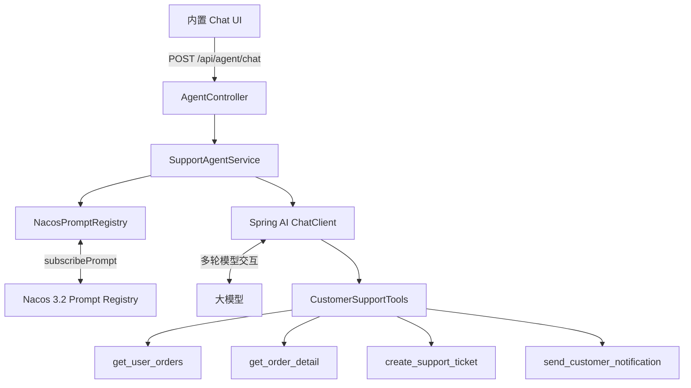
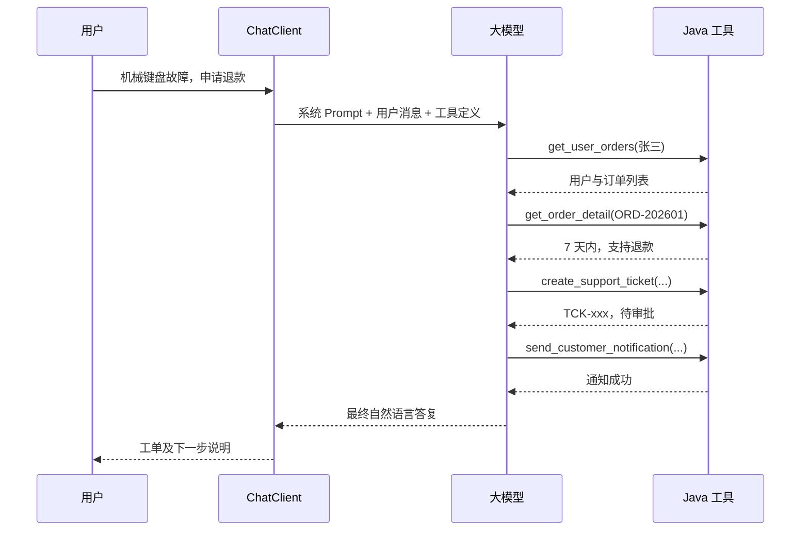

# Spring AI × Nacos 3.2：打造可动态治理 Prompt 的电商售后智能 Agent

> 当大模型开始调用退款、工单、通知等真实业务能力时，Prompt 就不再只是几行写在代码里的字符串，而是需要版本、发布、回滚与运行时治理的生产资产。本文通过一个完整的电商售后 Demo，介绍如何用 Spring AI 实现多步工具调用，并用 Nacos 3.2 Prompt Registry 动态管理 Agent 的系统提示词。

## 一、为什么是 Spring AI + Nacos？

传统聊天机器人通常只完成一次“输入问题、输出文本”。真正的业务 Agent 则需要连续执行多个步骤：

```text
理解用户诉求
  → 查询用户及订单
  → 查询订单详情和售后政策
  → 创建退款或换货工单
  → 发送用户通知
  → 汇总最终处理结果
```

这正是典型的 ReAct 工作方式：模型在推理、工具调用和结果观察之间循环，直到任务完成。

Spring AI 解决的是 Agent 的运行问题：

- 统一不同模型的调用接口；
- 将 Java 方法声明为模型可调用的工具；
- 通过 `ChatClient` 自动执行递归工具调用；
- 将工具结果写回上下文，让模型继续判断下一步。

Nacos 解决的是 Prompt 的治理问题：

- Prompt 集中存储；
- 多版本管理；
- latest 或业务版本标签；
- 在线、下线和回滚；
- Java SDK 运行时订阅变更；
- Prompt 修改后无需重新发布应用。

二者组合后，模型编排能力与 Prompt 治理能力被清晰地分开：

```text
Spring AI：负责执行 Agent
Nacos：负责治理 Agent 使用的 Prompt
Java 业务代码：负责真实规则和安全边界
```

## 二、项目技术栈

本文 Demo 使用：

| 组件 | 版本 | 作用 |
|---|---:|---|
| Java | 21 | 应用运行环境 |
| Spring Boot | 4.0.3 | Web、配置、校验与运维基础 |
| Spring AI | 2.0.1 | ChatClient 与工具调用循环 |
| Nacos Client | 3.2.3 | Prompt 查询和变更订阅 |
| Nacos Server | 3.2.x | Prompt Registry 与版本治理 |
| OpenAI Starter | Spring AI BOM 管理 | 接入 OpenAI 兼容模型服务 |

主要 Maven 依赖如下：

```xml
<dependency>
    <groupId>org.springframework.ai</groupId>
    <artifactId>spring-ai-starter-model-openai</artifactId>
</dependency>

<dependency>
    <groupId>com.alibaba.nacos</groupId>
    <artifactId>nacos-client</artifactId>
    <version>3.2.3</version>
</dependency>
```

## 三、整体架构



项目分成五个清晰层次：

1. **UI 层**：提供浏览器聊天界面；
2. **Controller 层**：负责 HTTP 和参数校验；
3. **Agent 编排层**：组合动态系统 Prompt 与业务工具；
4. **Prompt 治理层**：批量订阅、缓存和更新 Nacos Prompt；
5. **工具层**：执行订单、政策、工单和通知业务。

## 四、用 Spring AI 声明业务工具

Spring AI 2 推荐使用 `@Tool` 和 `@ToolParam` 暴露 Java 方法。

例如查询用户订单：

```java
@Tool(
    name = "get_user_orders",
    description = "根据用户姓名或手机号，查询用户基本信息及最近历史订单。处理售后前必须先调用。"
)
public UserOrdersResponse getUserOrders(
        @ToolParam(description = "用户手机号或用户姓名")
        String userIdentifier) {
    // 实际项目中可替换为 Repository 或远程服务调用
    return users.get(userIdentifier);
}
```

查询订单政策：

```java
@Tool(
    name = "get_order_detail",
    description = "根据订单号查询签收时间、物流状态及当前是否支持退款/换货。"
)
public OrderDetailResponse getOrderDetail(
        @ToolParam(description = "订单编号") String orderId) {
    // 返回签收时间、物流状态与售后政策
}
```

创建售后工单属于写操作，不能只依赖 Prompt 约束。即使模型判断错误，Java 代码仍然要执行最终校验：

```java
if ("ORD-202602".equals(orderId) && !"REPAIR".equals(serviceType)) {
    return new CreateTicketResponse(
        null,
        "REJECTED",
        "订单已超过退换期，仅支持申请维修检测"
    );
}
```

这里体现了生产 Agent 的一个关键原则：

> Prompt 负责指导模型，Java 业务规则才是真正的安全边界。

## 五、ChatClient 如何完成多步工具调用

Agent 服务只需要将工具注册到 `ChatClient`：

```java
this.chatClient = builder
        .defaultTools(tools)
        .build();
```

处理用户请求时，动态读取 Nacos Prompt：

```java
public String handleUserMessage(String userPrompt) {
    return chatClient.prompt()
            .system(promptRegistry.get("support-system"))
            .user(userPrompt)
            .call()
            .content();
}
```

代码表面只有一次 `.call()`，实际内部可能发生多次模型调用：



在 Spring AI 2 中，这个循环由 `ChatClient` 自动注册的工具调用 Advisor 管理。模型提出工具调用，应用执行工具，再把结果返回模型，直到模型不再请求工具。

## 六、为什么不要把系统 Prompt 写死在代码中

最初的实现可能是：

```java
private static final String SYSTEM_PROMPT = """
    你是一位专业的售后客服……
    """;
```

这种方式适合快速验证，但进入团队协作后很快会暴露问题：

- Prompt 调整必须重新编译和发布；
- 无法记录版本和变更说明；
- 测试、灰度、生产难以使用不同版本；
- 下线错误版本缺少统一操作入口；
- 多个应用复用 Prompt 时容易产生副本漂移。

因此，本项目把 Prompt 迁移到 Nacos 3.2 Prompt Registry。

## 七、建立 Nacos AiService

通过 Nacos Java SDK 创建 `AiService`：

```java
@Configuration
public class NacosAiConfiguration {

    @Bean(destroyMethod = "shutdown")
    AiService nacosAiService(PromptProperties promptProperties)
            throws NacosException {
        var properties = new Properties();
        properties.setProperty(
            PropertyKeyConst.SERVER_ADDR,
            promptProperties.getServerAddr()
        );
        properties.setProperty(
            PropertyKeyConst.NAMESPACE,
            promptProperties.getNamespaceId()
        );
        return AiFactory.createAiService(properties);
    }
}
```

`destroyMethod = "shutdown"` 很重要，它确保应用关闭时释放 Nacos SDK 的连接和线程池。

## 八、从单 Prompt Provider 演进为多 Prompt Registry

真实应用往往不只有一条提示词，可能包含：

- Agent 系统规则；
- 退款政策说明；
- 工单摘要模板；
- 通知文案规范；
- 风险审核 Prompt。

如果为每个 Prompt 编写一个 Provider，类和监听器会迅速膨胀。因此，本项目使用统一的 `NacosPromptRegistry`。

配置采用“业务别名 → Nacos Prompt”的映射：

```yaml
support-agent:
  prompt:
    server-addr: ${NACOS_SERVER_ADDR:127.0.0.1:8848}
    namespace-id: ${NACOS_NAMESPACE_ID:public}
    bindings:
      support-system:
        key: SupportAgentService_SYSTEM_PROMPT
        label: production
        required: true

      refund-policy:
        key: RefundPolicy_PROMPT
        label: production
        required: false
```

其中：

- `support-system` 是应用内部使用的稳定别名；
- `key` 是 Nacos Prompt Key；
- `version` 用于固定具体版本；
- `label` 用于跟随版本标签；
- version 与 label 不能同时配置；
- 两者都不配置表示读取 latest；
- `required=true` 表示启动时必须加载成功。

业务代码不需要感知 Nacos Key：

```java
String systemPrompt = promptRegistry.get("support-system");
```

这样即使未来更换 Nacos Prompt Key，也不需要修改业务代码。

## 九、批量订阅 Prompt

Registry 启动时遍历全部绑定：

```java
@PostConstruct
void subscribeAll() {
    if (properties.getBindings().isEmpty()) {
        throw new IllegalStateException("未配置任何 Nacos Prompt 绑定");
    }
    properties.getBindings().forEach(this::subscribe);
}
```

每个 Prompt 都保存独立的 Listener：

```java
var listener = new AbstractNacosPromptListener() {
    @Override
    public void onEvent(NacosPromptEvent event) {
        if (event == null || event.getPrompt() == null) {
            handleUnavailable(name, binding);
        } else {
            update(name, event.getPrompt());
        }
    }
};
```

然后调用 Nacos SDK：

```java
var current = aiService.subscribePrompt(
    binding.getKey(),
    binding.getVersion(),
    binding.getLabel(),
    listener
);
```

需要特别注意参数顺序：

```java
subscribePrompt(promptKey, version, label, listener)
```

按标签订阅的正确写法是：

```java
subscribePrompt(promptKey, null, "production", listener);
```

而不是：

```java
// 错误：production 会被当作版本号
subscribePrompt(promptKey, "production", null, listener);
```

## 十、原子更新与 Last-Known-Good

Prompt 内容保存在 `ConcurrentHashMap` 中，每次更新生成不可变快照：

```java
public record PromptSnapshot(
    String promptKey,
    String version,
    String md5,
    String template
) {}
```

通过 MD5 避免重复替换：

```java
var previous = prompts.get(name);
if (previous != null && Objects.equals(previous.md5(), prompt.getMd5())) {
    return;
}

prompts.put(name, new PromptSnapshot(
    prompt.getPromptKey(),
    prompt.getVersion(),
    prompt.getMd5(),
    prompt.getTemplate()
));
```

如果当前订阅目标被下线，Nacos 可能发送 Prompt 为空的事件。这不表示监听器失效，而是表示当前 version、label 或 latest 已无法解析到在线版本。

本项目采用 Last-Known-Good 策略：

```java
if (event == null || event.getPrompt() == null) {
    // 保留最近一次有效 Prompt，同时产生告警
    handleUnavailable(name, binding);
    return;
}
```

这样短暂的发布操作不会立即清空生产 Agent 的系统规则。

## 十一、版本标签与业务标签不要混淆

Nacos Prompt 中有两类容易混淆的标签。

### 1. 业务标签 bizTags

业务标签属于整个 Prompt Key，用于分类和搜索：

```text
Prompt Key: SupportAgentService_SYSTEM_PROMPT
bizTags: 电商,售后,客服
```

因此所有版本看起来都会带有相同的业务标签。它不能用于 SDK 的版本路由。

### 2. 版本路由标签 labels

版本标签本质上是“标签到版本的指针”：

```text
production → 1.0.3
canary     → 1.1.0-beta
latest     → 1.0.3
```

`subscribePrompt(..., null, "production", listener)` 使用的是版本路由标签，而不是 bizTags。

推荐发布顺序：

```text
创建新版本
  → 上线新版本
  → 将 production 指向新版本
  → 确认客户端收到更新
  → 下线旧版本
```

不要先下线 production 当前指向的版本，否则订阅目标会暂时变成空。

## 十二、应用关闭时必须取消订阅

Nacos 要求取消订阅时使用和订阅时相同的：

- Prompt Key；
- version；
- label；
- Listener 实例。

因此 Registry 会保存完整订阅信息：

```java
private record Subscription(
    PromptProperties.Binding binding,
    AbstractNacosPromptListener listener
) {}
```

关闭时逐个取消：

```java
@PreDestroy
void unsubscribeAll() {
    subscriptions.forEach((name, subscription) -> {
        var binding = subscription.binding();
        aiService.unsubscribePrompt(
            binding.getKey(),
            binding.getVersion(),
            binding.getLabel(),
            subscription.listener()
        );
    });
}
```

## 十三、API 与内置 Chat UI

Controller 对输入进行校验，并返回稳定 JSON 结构：

```java
@PostMapping("/chat")
public AgentResponse executeAgent(
        @Valid @RequestBody AgentRequest request) {
    return new AgentResponse(
        supportAgentService.handleUserMessage(request.prompt())
    );
}
```

请求示例：

```http
POST /api/agent/chat
Content-Type: application/json

{
  "prompt": "我是张三，机械键盘按键连击失灵，帮我申请退货退款。"
}
```

项目还在 `src/main/resources/static/index.html` 中内置了零构建步骤的 Chat UI。前后端同源部署，不需要 Node.js、npm 或额外的 CORS 配置。

## 十四、配置模型服务

模型密钥不要写入 Git。公共配置使用环境变量：

```yaml
spring:
  ai:
    openai:
      api-key: ${OPENAI_API_KEY}
      base-url: ${OPENAI_BASE_URL:https://api.openai.com}
      chat:
        options:
          model: ${OPENAI_MODEL:gpt-4.1-mini}
          temperature: 0.1
```

对于支持 OpenAI 协议和 Tool Calling 的兼容模型服务，只需要调整 Base URL、Key 和模型 ID。

## 十五、测试策略

项目测试不请求真实模型，也不会消耗 Token，主要覆盖三层行为。

### 工具测试

- 正常退款链路；
- 未知用户；
- 非法工单；
- 超过退换期时拒绝退款。

### Controller 测试

- 正常 JSON 响应；
- 空 Prompt 返回 HTTP 400。

### Prompt Registry 测试

- 按业务别名订阅；
- version 与 label 参数位置正确；
- Nacos 事件到达后更新 Prompt；
- Snapshot 中版本同步变化。

测试命令：

```bash
mvn test
```

## 十六、当前 Demo 与生产系统之间还有多远？

Demo 已经展示了完整的技术链路，但生产化仍建议补充：

1. **数据库与外部服务**：将模拟数据替换为订单、工单和通知服务；
2. **幂等控制**：避免模型或用户重试导致重复创建工单；
3. **身份认证**：不能只根据用户口述的姓名操作订单；
4. **人工审批**：高金额退款等敏感工具应加入人工确认；
5. **审计日志**：记录模型、Prompt 版本、工具参数和操作结果；
6. **可观测性**：监控模型耗时、Token、工具错误和 Prompt 更新状态；
7. **会话记忆**：当前接口是单轮请求，生产系统可引入 ChatMemory；
8. **发布规范**：先上线新 Prompt、切换标签，再下线旧版本；
9. **安全配置**：API Key 使用环境变量或密钥管理系统；
10. **Prompt 健康指标**：暴露当前别名、版本和更新时间，但不要暴露 Prompt 全文。

## 十七、总结

这个项目验证了一条清晰、务实的 Java Agent 工程路线：

```text
Spring AI
  负责模型接入、工具描述和递归调用

Nacos Prompt Registry
  负责 Prompt 的版本、标签、订阅与运行时治理

Java 业务服务
  负责数据真实性、权限、安全与最终执行
```

Spring AI 让 Java 开发者可以沿用熟悉的 Spring 编程模型构建 Agent；Nacos 则让 Prompt 从“藏在代码里的字符串”升级为可治理的生产配置资产。

两者结合的价值并不只是“Prompt 可以热更新”，而是建立了模型编排、配置治理与业务安全之间明确的职责边界。对于已经采用 Spring Boot 和 Nacos 的企业应用，这是一条成本低、迁移平滑、又具备生产演进空间的 Agent 落地路径。

## 参考资料

- [Spring AI Tool Calling](https://docs.spring.io/spring-ai/reference/api/tools.html)
- [Spring AI ChatClient](https://docs.spring.io/spring-ai/reference/api/chatclient.html)
- [Nacos Java SDK 使用手册](https://nacos.io/docs/latest/manual/user/java-sdk/usage/)
- [Nacos Prompt 管理](https://nacos.io/docs/latest/manual/user/ai/prompt-registry/)
- [Nacos AI Prompt 管理 API](https://nacos.io/docs/latest/manual/admin/admin-api/)

